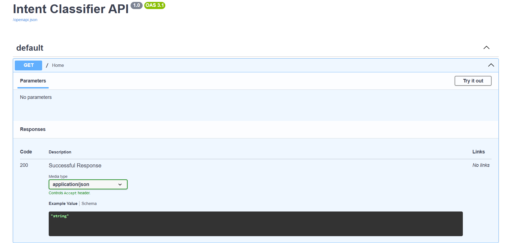
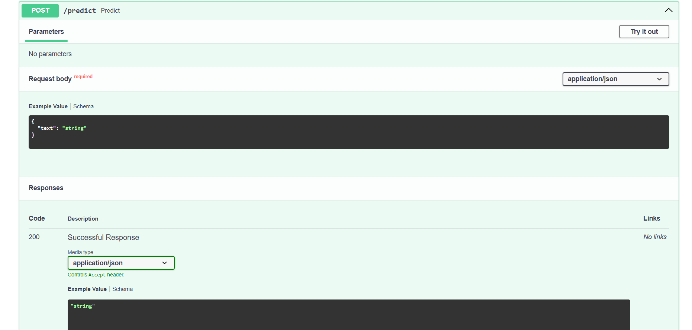

# 🧠 User Intent Classifier — NLP + BiLSTM

## 📌 Project Overview
Classifies user text into 151 intents using BiLSTM on CLINC150 dataset (23,700 samples).

## 🚀 Run Streamlit App
```bash
streamlit run app.py
```

## ⚡ Run FastAPI
```bash
uvicorn main:app --reload
http://127.0.0.1:8000
```

### 📖 Swagger API Documentation

```
http://127.0.0.1:8000/docs
```
## 📸 Screenshots

### Swagger API



---

### Prediction Example



---

## 🐳 Run with Docker
```bash
docker build -t intent-classifier .
docker run -p 8000:8000 intent-classifier
```

## 📁 Project Structure
```
├── app.py              # Streamlit UI
├── main.py             # FastAPI backend
├── Dockerfile          # Docker config
├── requirements.txt    # Dependencies
├── intent_model.h5     # Trained model
├── tokenizer.pkl       # Tokenizer
└── label_encoder.pkl   # Label encoder
```

## 🏆 Results
- Dataset: CLINC150 (151 classes, 23,700 samples)
- Model: BiLSTM
- Val Accuracy: ~85-90% (GPU, 20 epochs)

## 🛠 Tech Stack
Python | TensorFlow | Keras | FastAPI | Streamlit | Docker
